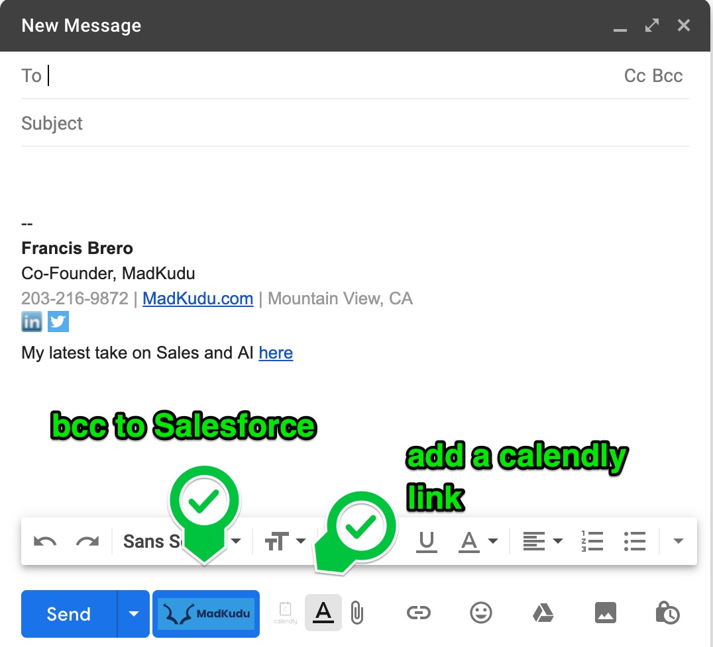

# MadKudu Specter - Alpha
A gmail extension that adds a button to your Gmail compose view in order to automatically bcc Salesforce and add another button to automatically add a calendly link to your email

Here's a quick video tutorial to get started with the MadKudu Specter - Alpha
https://www.loom.com/share/3864217be9b34cf5907f1ee024dac6f4

# Getting Started
## Clone this repository (or download) to your local

## Update the file ./myapp.js
At the top of the file, edit the configuration parameters
- Input your Salesforce bcc email
- Input your calendly link
Save your file locally (DO NOT COMMIT!)

## Add the extension to chrome
- Go to chrome://extensions
- Enable developer model
- Click "Load unpacked"
- Select the folder gmail_foolery from your local

## Refresh Gmail and Enjoy!

feedback and comments welcome => please open an issue here